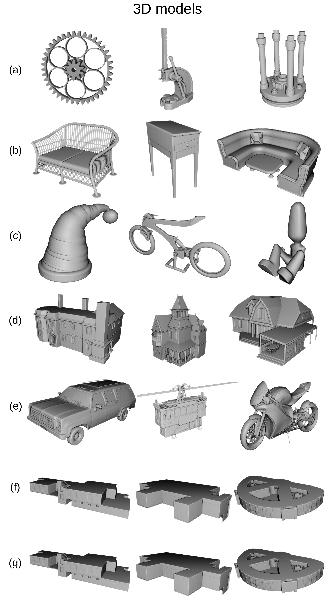
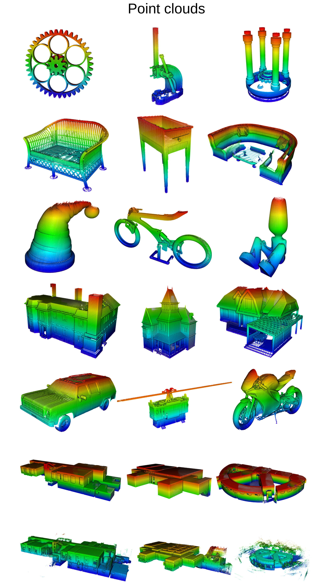

<p align="center">
  
</p>

<h1 align="center">PC2Model</h1>
<p align="center">
  <b>ISPRS Benchmark for 3D Point Cloud-to-Model Registration</b>
</p>

<p align="center">
  <a href="https://arxiv.org/abs/2604.19596">Paper</a> •
  <a href="https://zenodo.org/uploads/17581812">Dataset (Zenodo)</a> •
  <a href="https://github.com/saidharb/PC2Model.git">Tools & Scripts</a>
</p>

---

## Overview

**PC2Model** is a benchmark dataset for **point cloud-to-model registration**, where the goal is to align a 3D point cloud with a reference 3D model.

While point cloud-to-point cloud registration is well studied, the point cloud-to-model setting remains comparatively underexplored in existing benchmarks. PC2Model addresses this gap by providing a **dedicated dataset with ground truth transformations**, enabling consistent evaluation of both classical and learning-based approaches.

The dataset follows a **hybrid design** of six simulated categories and one real category.

<p align="center">
  
  
</p>

---

## 📂 Dataset Structure

The v1.4 dataset is organized by category. Each category contains one folder per sample:

```text
pc2model_v1.4/
├── mechanical/
│   └── mec_000-thingi10k/
├── furniture/
│   └── fur_000-thingi10k/
├── home_decor/
│   └── hdc_000-thingi10k/
├── house/
│   └── house_0-sketchfab/
├── vehicle/
│   └── veh_000-sketchfab/
├── indoor_modelling/
│   └── indoor_modelling_0-ISPRS_indoor_modelling-TUBS1/
└── ISPRS_indoor_modeling_benchmark/
    └── real-indoor_modelling_0-ISPRS_indoor_modelling-TUBS1/
```

Each sample folder contains three files:

```text
<sample>/
├── model_<sample>.obj
├── pointcloud_<sample>_transformed.e57
└── transformation_matrix_pc2model_<sample>.txt
```

Example:

```text
vehicle/veh_000-sketchfab/
├── model_veh_000-sketchfab.obj
├── pointcloud_veh_000-sketchfab_transformed.e57
└── transformation_matrix_pc2model_veh_000-sketchfab.txt
```

---

### Data Formats

- **`.obj`** → 3D models
- **`.e57`** → point clouds (includes scanner positions and multiple scans)
- **`.txt`** → transformation matrices (homogeneous format)

---

## 📊 Dataset Statistics

| Source          | Category           | Samples       |
| --------------- | ------------------ | ------------- |
| Simulated       | Mechanical objects | 25            |
| Simulated       | Furniture          | 25            |
| Simulated       | Home décor        | 25            |
| Simulated       | Houses             | 25            |
| Simulated       | Vehicles           | 25            |
| Simulated       | Indoor spaces      | 6             |
| Real            | Indoor spaces      | 6             |
| **Total** |                    | **137** |

---

## Key Features

### Hybrid Dataset Design

- Consisting of six simulated categories  and one real category

### Realistic LiDAR Artefacts

- Occlusions and missing regions
- Noise and measurement inaccuracies
- Mixed pixels
- Point density variation

### Ground Truth Transformations

- Random rotations (0°–360°)
- Relative translations based on object size
- Optional scaling (50% probability)

### Dataset Diversity

- Multiple object categories and scales
- From small objects to large indoor environments

---

## Evaluation Protocol

The following metrics were used for evaluating registration performance on the PC2Model benchmark, with ICP (via CloudCompare and Open3D) as a baseline:

* **LOA (Level of Accuracy):** Mean and median closest-point distance between the registered point cloud and the model surface.
* **LOC (Level of Coverage):** Ratio of sampled model surface points that are covered by the point cloud within a predefined distance threshold.
* **Transformation error:** Includes normalized translation error (with respect to the bounding box diagonal) and rotation error computed as the geodesic distance between estimated and ground-truth rotations.

---

## Data Generation (Summary)

The dataset was generated using:

- **Helios++** for LiDAR simulation integrated into a custom **Blender add-on** for scene setup and scanner placement

The simulation replicates a **terrestrial laser scanner (Leica ScanStation P40)** and includes realistic scanning effects such as beam divergence, noise, and occlusions.

Full pipeline and implementation details are available in the tools repository.

---

## Tools & Scripts

All scripts and tools used to generate and process the dataset are available [here](https://github.com/saidharb/PC2Model).

Includes:

- Blender add-on
- Helios++ configurations
- Dataset generation pipeline
- Utility scripts

---

## Use Cases

PC2Model supports research and development in:

- Point cloud-to-model co-registration using classical methods (e.g., ICP, NDT, FGR)
- Learning-based registration and feature matching (e.g., DCP, PointNetLK)
- Evaluation of algorithms under realistic LiDAR artefacts (noise, occlusions, density variation)
- Large-scale and complex scene registration (indoor environments and houses)

---

## Updates & Changelog

- **v1.4** – First public release of the PC2Model benchmark. This version introduces a refined dataset structure with category-based organization, reference OBJ models, transformed E57 point clouds, and ground truth transformation matrices for each sample.

---

## Download

The dataset is hosted on Zenodo and can be accessed on [Zenodo](https://zenodo.org/uploads/17581812).

---

## License

The dataset is released under an open license. Please refer to the Zenodo page for full licensing terms and conditions.

---

---

## Citation

If you use this dataset, please cite:

```bibtex
@article{Maboudi2026,
   title = {PC2Model: ISPRS benchmark on 3D point cloud to model registration},
   author = {Mehdi Maboudi and Said Harb and Jackson Ferrao and Kourosh Khoshelham and Yelda Turkan and Karam Mawas},
   year = {2026}
}
```
